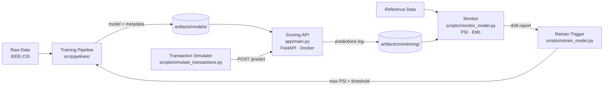

# Fraud Detection ML System

> End-to-end machine learning system for card-not-present fraud detection — from raw data to a containerized inference API with drift monitoring and automated retraining simulation.


---

## Key Results

| Metric | Value |
|---|---|
| ROC-AUC | **0.861** |
| PR-AUC | **0.409** |
| Expected Loss Reduction | **58.7%** ($357,989 vs $609,934 baseline) |
| Operating Threshold | **0.02** (cost-minimization optimized) |
| Precision at threshold | 10.1% (industry-typical for fraud at 3.5% base rate) |
| Features | 380 numeric features (transaction + identity) |
| Dataset | IEEE-CIS · ~590,000 transactions |

> Metrics evaluated on a temporal hold-out set (most recent 20% of transactions). No data leakage.

### Kaggle Extension (Phase 8)

The system was extended into a Kaggle-competitive investigation on the IEEE-CIS
leaderboard (late submissions), framed as four pre-registered hypotheses. A
single, explainable LightGBM with entity-aggregation features reached **private
LB 0.9078** (public 0.9377), up from the production pipeline's 0.8749 on the same
Kaggle test set.

| Milestone | Private LB |
|---|---|
| Production pipeline (sklearn GB, numeric-only) | 0.8749 |
| **This project — single LightGBM + feature engineering** | **0.9078** |
| Reference: strongest public single model (Deotte) | 0.9324 |
| Reference: 1st-place ensemble | 0.9459 |

The headline is the method, not the number: every gain was scored one feature
block at a time on the frozen leaderboard, compared with a DeLong test on an
internal temporal holdout, and given an honest verdict — including four
hypotheses that returned inconclusive or rejected. Central finding: **internal
validation systematically overstates private-LB gains under temporal drift**, and
a seen/unseen-client diagnostic (holdout AUC 0.99 on known clients vs 0.90 on new
ones) explains why. Full write-up in [`docs/kaggle/`](docs/kaggle/).

> Late submissions receive leaderboard scores but no rank. This was a
> learning-focused single-model investigation, deliberately without the
> multi-model ensembling and post-processing the top solutions used.

---

## System Architecture



---

## Skills Demonstrated

| Phase | Focus | Skills |
|---|---|---|
| **0** | System design | ML system architecture, cost modeling, metric design |
| **1** | Baseline modeling | Cost-sensitive threshold optimization, temporal validation |
| **2** | Statistical diagnostics | EDA, distribution analysis, class imbalance characterization |
| **3** | Advanced modeling | Model comparison, PR-AUC, Expected Monetary Loss framework |
| **4** | ML Engineering | Modular pipelines, artifact versioning, experiment tracking, unit tests |
| **5** | Deployment simulation | FastAPI, Docker, PSI drift monitoring, retraining automation |
| **6** | Communication | Executive reporting, trade-off analysis, technical documentation |
| **7** | Interview readiness | Architecture diagrams, ADRs, hyperparameter analysis, demo runbook |
| **8** | Kaggle-competitive modeling | LightGBM, entity/UID aggregation, DeLong AUC tests, pre-registered hypotheses, temporal-drift diagnostics |

---

## Project Phases

**Phase 0 — System Framing and Architecture**
Defined the business problem as cost-sensitive decision optimization. Designed the evaluation framework around Expected Monetary Loss rather than accuracy. Documented system scope, latency constraints, and architecture.
→ [`docs/01_system_scope.md`](docs/01_system_scope.md) · [`docs/04_architecture.md`](docs/04_architecture.md)

**Phase 1 — Baseline Modeling and Cost-Sensitive Evaluation**
Trained a Logistic Regression baseline. Implemented threshold sweep for EML minimization. Established temporal train/validation split to avoid data leakage.
→ [`docs/05_modeling_strategy.md`](docs/05_modeling_strategy.md)

**Phase 2 — Statistical Diagnostics**
Characterized dataset distributions, missing value patterns, and class imbalance. Identified high-cardinality categorical features and temporal structure.
→ [`docs/02_data_understanding.md`](docs/02_data_understanding.md) · [`docs/06_statistical_diagnostics.md`](docs/06_statistical_diagnostics.md)

**Phase 3 — Advanced Modeling and Model Comparison**
Trained and compared Logistic Regression, Random Forest, and Gradient Boosting under the same cost-sensitive framework. Selected GB as the deployed model.
→ [`docs/07_model_comparison.md`](docs/07_model_comparison.md) · [`notebooks/model_comparison_v1.ipynb`](notebooks/model_comparison_v1.ipynb)

**Phase 4 — ML Engineering Pipeline**
Refactored notebooks into a modular `src/` package. Implemented artifact versioning, experiment tracking, and a CLI training script. Added unit tests.
→ [`docs/08_ml_pipeline.md`](docs/08_ml_pipeline.md)

**Phase 5 — Deployment Simulation and Monitoring**
Built a FastAPI scoring service with feature contract enforcement. Containerized with Docker. Implemented PSI-based drift monitoring and automated retraining simulation.
→ [`docs/09_deployment_and_monitoring.md`](docs/09_deployment_and_monitoring.md)

**Phase 6 — Reporting and Technical Communication**
Executive summary, technical deep-dive, trade-off analysis, model limitations, and this README.
→ [`docs/10_executive_summary.md`](docs/10_executive_summary.md) · [`docs/11_technical_report.md`](docs/11_technical_report.md)

**Phase 7 — Interview Maximization**
Architecture diagrams, hyperparameter analysis, Architecture Decision Records, extensions roadmap, and demo runbook.
→ [`docs/diagrams/01_system_architecture.md`](docs/diagrams/01_system_architecture.md) · [`docs/14_hyperparameter_guide.md`](docs/14_hyperparameter_guide.md) · [`docs/decisions/`](docs/decisions/) · [`DEMO.md`](DEMO.md)

**Phase 8 — Kaggle-Competitive Modeling** *(extension)*
Reframed modeling as a pre-registered research question (H1–H4) on the IEEE-CIS leaderboard. Built a LightGBM pipeline with categorical encodings, time/amount features, and entity (UID) aggregations replicating the competition's winning technique. Every experiment registered before running and every submission logged before upload; AUC comparisons via the DeLong test on a temporal holdout. Reached single-model private LB 0.9078 and established that internal validation overstates private-LB gains under temporal drift.
→ [`docs/kaggle/research.md`](docs/kaggle/research.md) · [`docs/kaggle/gap-analysis.md`](docs/kaggle/gap-analysis.md) · [`docs/kaggle/fe-playbook.md`](docs/kaggle/fe-playbook.md) · [`docs/kaggle/validation-and-selection-playbook.md`](docs/kaggle/validation-and-selection-playbook.md)

---

## Quick Start

```bash
# Clone and install
git clone https://github.com/brunoramosmartins/fraud-detection-ml.git
cd fraud-detection-ml
make setup                   # creates .venv and installs requirements-dev.txt

# Full demo pipeline (train + test)
make demo

# Or step by step
make train                   # train GB model
make test                    # run 28 unit tests with coverage
make api                     # start API on port 8000 (Terminal 1)
make simulate                # score 500 transactions (Terminal 2)
make monitor                 # compute PSI and performance metrics
```

See [`DEMO.md`](DEMO.md) for the full interview walkthrough with anticipated questions and answers.

### Manual Setup (without Make)

```bash
python -m venv .venv && source .venv/Scripts/activate  # Windows
pip install -r requirements-dev.txt
python scripts/train_model.py --model gb --config configs/model_gb_v1.yml
python -m pytest tests/ -v
uvicorn app.main:app --host 0.0.0.0 --port 8000
```

Place the IEEE-CIS dataset files in `data/raw/` before training:
- `train_transaction.csv`
- `train_identity.csv`

---

## Repository Structure

```
fraud-detection-ml/
│
├── app/                        # FastAPI scoring service
│   └── main.py                 #   POST /predict · GET /health
│
├── src/                        # Core library
│   ├── data/                   #   Loader, schema validation, temporal split
│   ├── features/               #   Feature registry and pipeline
│   ├── models/                 #   Metrics, training factory, artifact management
│   ├── pipelines/              #   End-to-end training pipeline
│   └── utils/                  #   Config, tracking, PSI drift
│
├── scripts/                    # Operational scripts
│   ├── train_model.py          #   CLI training entrypoint
│   ├── evaluate_model.py       #   End-to-end model evaluation
│   ├── simulate_transactions.py#   Batch scoring simulation
│   ├── monitor_model.py        #   Drift + performance monitoring
│   └── retrain_model.py        #   Conditional retraining trigger
│
├── tests/                      # Unit tests (28 passing)
│   ├── test_api_scoring.py
│   ├── test_data_loader.py
│   ├── test_drift_metrics.py
│   ├── test_factory.py
│   ├── test_features.py
│   └── test_metrics.py
│
├── configs/                    # Training configurations (YAML: GB, LR, RF)
├── docs/                       # Documentation (Phases 0–7)
│   ├── diagrams/               #   Architecture diagrams (Mermaid)
│   ├── decisions/              #   Architecture Decision Records (ADR-001–005)
│   └── *.md                    #   Phase documents, trade-offs, limitations
├── notebooks/                  # Exploratory and reporting notebooks
├── artifacts/                  # Model artifacts and run metadata
│   ├── models/                 #   Trained models + metadata JSON
│   └── runs/                   #   Experiment run records
│
├── Dockerfile
├── docker-compose.yml          # One-command deployment
├── Makefile                    # One-command demo pipeline
├── pyproject.toml              # Project metadata, pytest, ruff config
├── .pre-commit-config.yaml     # Ruff linting and formatting hooks
├── .github/workflows/ci.yml   # CI: lint + test + coverage
├── DEMO.md                     # Interview runbook with Q&A
├── CONTRIBUTING.md             # Dev setup and commit conventions
├── requirements.txt            # Production dependencies
└── requirements-dev.txt        # Development + test dependencies
```

---

## Documentation Index

| Document | Audience | Description |
|---|---|---|
| [`DEMO.md`](DEMO.md) | Interview | 5-minute walkthrough, commands, anticipated Q&A |
| [`docs/10_executive_summary.md`](docs/10_executive_summary.md) | Business | Non-technical summary with monetary impact |
| [`docs/11_technical_report.md`](docs/11_technical_report.md) | Engineering | Architecture, modeling decisions, production gap |
| [`docs/12_trade_off_analysis.md`](docs/12_trade_off_analysis.md) | Engineering | 6 trade-offs with rejected alternatives |
| [`docs/13_model_limitations.md`](docs/13_model_limitations.md) | Engineering | 7 limitations and failure modes |
| [`docs/14_hyperparameter_guide.md`](docs/14_hyperparameter_guide.md) | Engineering | GB hyperparameter reasoning and sensitivity |
| [`docs/diagrams/01_system_architecture.md`](docs/diagrams/01_system_architecture.md) | Engineering | 5 Mermaid diagrams (topology, request flow, startup) |
| [`docs/decisions/`](docs/decisions/) | Engineering | 5 Architecture Decision Records (ADR-001–005) |
| [`docs/15_extensions_roadmap.md`](docs/15_extensions_roadmap.md) | Engineering | 13 concrete next steps toward production |
| [`docs/09_deployment_and_monitoring.md`](docs/09_deployment_and_monitoring.md) | Engineering | Deployment and monitoring guide |
| [`notebooks/06_results_dashboard.ipynb`](notebooks/06_results_dashboard.ipynb) | All | Visual metrics dashboard (ROC, PR, confusion matrix, EML) |

---

## Dataset

This project uses the [IEEE-CIS Fraud Detection dataset](https://www.kaggle.com/c/ieee-fraud-detection) (Kaggle).

- ~590,000 e-commerce transactions
- ~3.5% fraud rate
- Transaction and identity tables joined on `TransactionID`
- Raw data is not included in this repository

---

## Disclaimer

This project uses the IEEE-CIS dataset as a proxy for real banking data. Cost parameters, fraud rates, and operational assumptions are simulated for portfolio and educational purposes. This system is not intended for production deployment without additional validation, security review, and regulatory compliance assessment.
