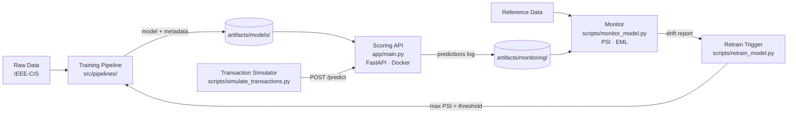

# Fraud Detection ML System

> End-to-end machine learning system for card-not-present fraud detection — from raw data to a containerized inference API with drift monitoring and automated retraining simulation.


---

## Key Results

| Metric | Value |
|---|---|
| ROC-AUC | **0.861** |
| PR-AUC | **0.409** |
| Expected Loss Reduction | **58.7%** ($357,989 vs $609,934 baseline) |
| Operating Threshold | **0.02** (cost-minimization optimized) |
| Precision at threshold | 10.1% (industry-typical for fraud at 3.5% base rate) |
| Features | 380 numeric features (transaction + identity) |
| Dataset | IEEE-CIS · ~590,000 transactions |

> Metrics evaluated on a temporal hold-out set (most recent 20% of transactions). No data leakage.

---

## System Architecture



---

## Skills Demonstrated

| Phase | Focus | Skills |
|---|---|---|
| **0** | System design | ML system architecture, cost modeling, metric design |
| **1** | Baseline modeling | Cost-sensitive threshold optimization, temporal validation |
| **2** | Statistical diagnostics | EDA, distribution analysis, class imbalance characterization |
| **3** | Advanced modeling | Model comparison, PR-AUC, Expected Monetary Loss framework |
| **4** | ML Engineering | Modular pipelines, artifact versioning, experiment tracking, unit tests |
| **5** | Deployment simulation | FastAPI, Docker, PSI drift monitoring, retraining automation |
| **6** | Communication | Executive reporting, trade-off analysis, technical documentation |

---

## Project Phases

**Phase 0 — System Framing and Architecture**
Defined the business problem as cost-sensitive decision optimization. Designed the evaluation framework around Expected Monetary Loss rather than accuracy. Documented system scope, latency constraints, and architecture.
→ [`docs/01_system_scope.md`](docs/01_system_scope.md) · [`docs/04_architecture.md`](docs/04_architecture.md)

**Phase 1 — Baseline Modeling and Cost-Sensitive Evaluation**
Trained a Logistic Regression baseline. Implemented threshold sweep for EML minimization. Established temporal train/validation split to avoid data leakage.
→ [`docs/05_modeling_strategy.md`](docs/05_modeling_strategy.md)

**Phase 2 — Statistical Diagnostics**
Characterized dataset distributions, missing value patterns, and class imbalance. Identified high-cardinality categorical features and temporal structure.
→ [`docs/02_data_understanding.md`](docs/02_data_understanding.md) · [`docs/06_statistical_diagnostics.md`](docs/06_statistical_diagnostics.md)

**Phase 3 — Advanced Modeling and Model Comparison**
Trained and compared Logistic Regression, Random Forest, and Gradient Boosting under the same cost-sensitive framework. Selected GB as the deployed model.
→ [`docs/07_model_comparison.md`](docs/07_model_comparison.md) · [`notebooks/model_comparison_v1.ipynb`](notebooks/model_comparison_v1.ipynb)

**Phase 4 — ML Engineering Pipeline**
Refactored notebooks into a modular `src/` package. Implemented artifact versioning, experiment tracking, and a CLI training script. Added unit tests.
→ [`docs/08_ml_pipeline.md`](docs/08_ml_pipeline.md)

**Phase 5 — Deployment Simulation and Monitoring**
Built a FastAPI scoring service with feature contract enforcement. Containerized with Docker. Implemented PSI-based drift monitoring and automated retraining simulation.
→ [`docs/09_deployment_and_monitoring.md`](docs/09_deployment_and_monitoring.md)

**Phase 6 — Reporting and Technical Communication**
Executive summary, technical deep-dive, trade-off analysis, model limitations, and this README.
→ [`docs/10_executive_summary.md`](docs/10_executive_summary.md) · [`docs/11_technical_report.md`](docs/11_technical_report.md)

---

## Quick Start

### Prerequisites

```bash
git clone https://github.com/brunoramosmartins/fraud-detection-ml.git
cd fraud-detection-ml
python -m venv .venv && source .venv/Scripts/activate  # Windows
pip install -r requirements-dev.txt
```

Place the IEEE-CIS dataset files in `data/raw/`:
- `train_transaction.csv`
- `train_identity.csv`

### Train a model

```bash
python scripts/train_model.py \
  --model gb \
  --config configs/model_gb_v1.yml
```

### Run tests

```bash
python -m pytest tests/ -v
```

### Start the scoring API

```bash
uvicorn app.main:app --host 0.0.0.0 --port 8000
# or
docker build -t fraud-api:latest . && docker run -p 8000:8000 fraud-api:latest
```

### Simulate transactions and monitor

```bash
python scripts/simulate_transactions.py --max-batches 5
python scripts/monitor_model.py \
  --reference-path data/raw/train_transaction.csv \
  --predictions-path artifacts/monitoring/predictions/predictions_<ts>.csv
```

---

## Repository Structure

```
fraud-detection-ml/
│
├── app/                        # FastAPI scoring service
│   └── main.py                 #   POST /predict · GET /health
│
├── src/                        # Core library
│   ├── data/                   #   Loader, schema validation, temporal split
│   ├── features/               #   Feature registry and pipeline
│   ├── models/                 #   Metrics, training factory, artifact management
│   ├── pipelines/              #   End-to-end training pipeline
│   └── utils/                  #   Config, tracking, PSI drift
│
├── scripts/                    # Operational scripts
│   ├── train_model.py          #   CLI training entrypoint
│   ├── simulate_transactions.py#   Batch scoring simulation
│   ├── monitor_model.py        #   Drift + performance monitoring
│   └── retrain_model.py        #   Conditional retraining trigger
│
├── tests/                      # Unit tests (14 passing)
│   ├── test_api_scoring.py
│   ├── test_drift_metrics.py
│   └── test_metrics.py
│
├── configs/                    # Training configurations (YAML)
├── docs/                       # Documentation (Phases 0–6)
├── notebooks/                  # Exploratory and reporting notebooks
├── artifacts/                  # Model artifacts and run metadata
│   ├── models/                 #   Trained models + metadata JSON
│   └── runs/                   #   Experiment run records
│
├── Dockerfile
├── requirements.txt            # Production dependencies
└── requirements-dev.txt        # Development + test dependencies
```

---

## Documentation Index

| Document | Description |
|---|---|
| [`docs/10_executive_summary.md`](docs/10_executive_summary.md) | Non-technical summary for business stakeholders |
| [`docs/11_technical_report.md`](docs/11_technical_report.md) | Architecture decisions and engineering rationale |
| [`docs/12_trade_off_analysis.md`](docs/12_trade_off_analysis.md) | Trade-offs and rejected alternatives |
| [`docs/13_model_limitations.md`](docs/13_model_limitations.md) | Limitations and failure mode analysis |
| [`docs/09_deployment_and_monitoring.md`](docs/09_deployment_and_monitoring.md) | Deployment and monitoring guide |
| [`docs/08_ml_pipeline.md`](docs/08_ml_pipeline.md) | ML pipeline architecture |
| [`docs/07_model_comparison.md`](docs/07_model_comparison.md) | Model comparison results |

---

## Dataset

This project uses the [IEEE-CIS Fraud Detection dataset](https://www.kaggle.com/c/ieee-fraud-detection) (Kaggle).

- ~590,000 e-commerce transactions
- ~3.5% fraud rate
- Transaction and identity tables joined on `TransactionID`
- Raw data is not included in this repository

---

## Disclaimer

This project uses the IEEE-CIS dataset as a proxy for real banking data. Cost parameters, fraud rates, and operational assumptions are simulated for portfolio and educational purposes. This system is not intended for production deployment without additional validation, security review, and regulatory compliance assessment.
