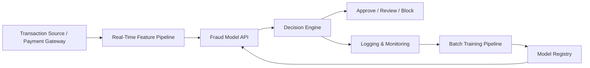
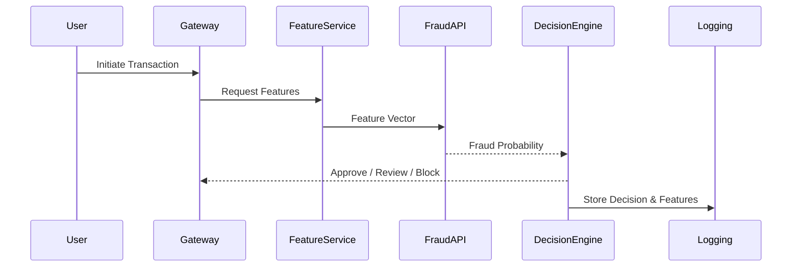

# Fraud Detection System – High-Level Architecture

## 1. Overview

This document describes the high-level architecture of a fraud detection system designed to evaluate card-not-present (CNP) e-commerce transactions in near real-time.

The goal is to simulate a production-grade antifraud system typically used in banking or fintech environments.

The architecture separates real-time scoring from batch model lifecycle processes.

---

## 2. Architecture Principles

The system is designed following these principles:

- Low latency real-time scoring
- Clear separation between prediction and decision logic
- Reproducible model training
- Traceable and auditable predictions
- Scalable data pipelines
- Continuous monitoring and retraining

---

## 3. High-Level Components

The system contains the following components:

### 1. Transaction Source
Represents the payment gateway or transaction stream that sends transaction events to the fraud detection system.

### 2. Feature Pipeline (Real-Time)
Generates or retrieves features required by the fraud model.

Includes:
- Transaction metadata
- Device information
- Identity features
- Aggregated behavioral features (from historical data)

### 3. Fraud Model API
Machine learning service that predicts the probability of fraud for each transaction.

Input → feature vector  
Output → probability score (0–1)

The model itself is versioned and monitored.

### 4. Decision Engine
Applies business rules and thresholds to convert probability into an operational decision.

Possible outcomes:
- Approve
- Manual review
- Block

Thresholds are defined by the risk team and optimized to minimize expected loss.

### 5. Logging and Monitoring
Stores predictions, features, and decisions for audit and performance tracking.

Used for:
- Drift detection
- Model performance tracking
- Compliance audit trails
- Error analysis

### 6. Batch Training Pipeline
Offline process responsible for:

- Collecting labeled transactions
- Training new model versions
- Evaluating performance
- Recalibrating probabilities
- Deploying updated models

Runs periodically (e.g., weekly).

---

## 4. Real-Time Scoring Flow

1. Transaction arrives from payment gateway.
2. Feature pipeline retrieves required features.
3. Fraud model API predicts probability.
4. Decision engine assigns decision.
5. Result returned to payment system.
6. Logs stored for monitoring.

Target latency assumption: < 200 ms per transaction.

---

## 5. Batch Training Flow

1. Historical transactions are collected.
2. Labels (fraud/not fraud) are verified.
3. New model is trained.
4. Model is evaluated using cost-based metrics.
5. Model is calibrated and versioned.
6. If approved, model is deployed.

---

## 6. Architecture Diagram (Logical)

## 6.1 How to Interpret the Architecture

The first diagram shows the logical system components and data flow.  
Transactions arrive from the payment gateway, features are generated in real-time, and the fraud model produces a probability score. The decision engine then converts this probability into an operational action. All predictions are logged for monitoring and future retraining.

The second diagram illustrates the sequence of events for a single transaction, highlighting latency-sensitive components and the separation between prediction and decision logic.

---

## 6.2 Key Design Decisions

The architecture reflects common patterns used in antifraud systems:

**1. Separation of Model and Decision Logic**  
The machine learning model outputs a probability, while business rules determine the final action. This allows risk teams to adjust thresholds without retraining models.

**2. Real-Time vs Batch Separation**  
Real-time scoring is required for transaction approval, while training and monitoring occur offline to ensure stability and reproducibility.

**3. Logging for Auditability**  
All predictions and features are stored to support model monitoring, drift detection, and compliance audits.

**4. Model Versioning**  
Models are stored in a registry to allow rollback and reproducibility.

**5. Extensibility**  
The architecture allows future additions such as feature stores, manual review queues, or graph-based fraud detection.

These decisions simulate a production antifraud environment rather than a Kaggle-only modeling pipeline.

## 6.3 Limitations of This Architecture

This architecture is a simplified representation. In real production systems, additional components such as streaming infrastructure, feature stores, and high-availability deployments would be required.

---

## 7. Assumptions

Because real production infrastructure is not available, the following assumptions are made:

- Features are available at transaction time
- Fraud labels arrive with delay
- Fraud rate is approximately 1–3%
- Model retraining occurs weekly
- Manual review capacity is limited
- Thresholds are adjusted based on business cost

---

## 8. Out of Scope

Not included in this project:

- Real payment gateway integration
- Customer authentication workflows
- Graph-based fraud detection
- Regulatory certification

These may be future improvements.

---

## 9. Future Extensions

Possible future enhancements:

- Graph-based fraud detection
- Real-time feature store
- Online learning
- Customer risk profiling
- Adaptive thresholds

---

## 10. Next Steps

After architecture definition, the next phases are:

1. Data Understanding
2. Statistical Baseline
3. Modeling Strategy
4. Engineering Pipeline
5. Deployment Simulation
6. Monitoring and Communication