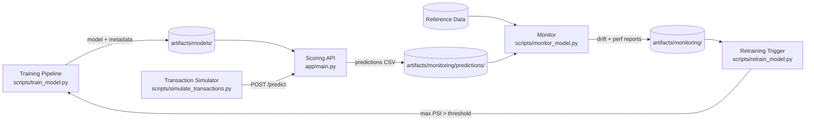

# Phase 5: Deployment and Monitoring

## 1. Overview

Phase 5 transforms the project from a training pipeline into a deployment simulation and monitoring system.
It shows how the trained fraud model would behave inside a production-like environment, with an API, container,
simulated transaction streams, monitoring (drift and performance), and a retraining trigger.

The goal is not to build full production infrastructure, but to demonstrate realistic ML engineering patterns
for a portfolio-quality project.

## 2. System Architecture



Main components:

- **Training pipeline** (`src/pipelines/training_pipeline.py`): trains models and writes artifacts to `artifacts/models` and run metadata to `artifacts/runs`.
- **Scoring API** (`app/main.py`): FastAPI service that loads a trained model artifact and exposes a `/predict` endpoint.
- **Transaction simulation** (`scripts/simulate_transactions.py`): sends batches of transactions to the API and records predictions.
- **Monitoring** (`scripts/monitor_model.py`): computes drift metrics (PSI) and performance metrics (e.g. Expected Monetary Loss) from prediction logs.
- **Retraining simulation** (`scripts/retrain_model.py`): triggers the training pipeline when monitoring signals exceed thresholds.
- **Artifacts** (`artifacts/`): central storage for models, runs, and monitoring outputs.

## 3. Quick Start

### Prerequisites

```bash
# Install production dependencies only
pip install -e .

# Install with dev / test dependencies
pip install -e ".[dev]"
```

### Step 1 — Train a model

```bash
python scripts/train_model.py \
  --model lgbm \
  --config configs/model_lgbm_v2.yml \
  --dataset-version ieee-cis-original
```

Artifacts written to `artifacts/models/lgbm_v2_<timestamp>.pkl` and `…_meta.json`.
(The v1 pipeline remains available: `--model gb --config configs/model_gb_v1.yml`.)

### Step 2 — Start the scoring API

```bash
uvicorn app.main:app --host 0.0.0.0 --port 8000
```

The API serves the newest artifact matching `DEPLOYED_MODEL_GLOB`
(default `lgbm_v2_*.pkl`). To roll back to the v1 model without a code
change:

```bash
DEPLOYED_MODEL_GLOB="gb_v1_*.pkl" uvicorn app.main:app --host 0.0.0.0 --port 8000
```

Or with Docker:

```bash
docker build -t fraud-api:latest .
docker run -p 8000:8000 fraud-api:latest
```

Verify the API is up:

```bash
curl http://localhost:8000/health
```

### Step 3 — Simulate transactions

```bash
python scripts/simulate_transactions.py \
  --api-url http://localhost:8000/predict \
  --batch-size 100 \
  --max-batches 5
```

Predictions log written to `artifacts/monitoring/predictions/predictions_<timestamp>.csv`.

### Step 4 — Monitor drift and performance

```bash
python scripts/monitor_model.py \
  --reference-path data/reference_split.csv \
  --predictions-path artifacts/monitoring/predictions/predictions_<timestamp>.csv \
  --psi-threshold 0.2
```

Reports written to:
- `artifacts/monitoring/drift/drift_report_<timestamp>.json`
- `artifacts/monitoring/performance/perf_report_<timestamp>.json`

### Step 5 — Trigger retraining (if drift detected)

```bash
python scripts/retrain_model.py \
  --config configs/model_lgbm_v2.yml \
  --drift-report artifacts/monitoring/drift/drift_report_<timestamp>.json \
  --psi-threshold 0.2
```

If `max_psi > psi_threshold`, the full training pipeline is re-executed and a new model artifact is saved.

## 4. Scoring API

- Location: `app/main.py`
- Technology: FastAPI + Uvicorn
- Endpoints:
  - `GET /health` — liveness and readiness probe
  - `POST /predict` — batch scoring

### Request

```json
{
  "transactions": [
    {
      "TransactionID": 1,
      "TransactionDT": 12345.0,
      "TransactionAmt": 100.0,
      "...": "any additional raw features"
    }
  ]
}
```

### Response

```json
{
  "model_name": "gb",
  "model_version": "v1",
  "threshold": 0.02,
  "predictions": [
    {
      "transaction_id": 1,
      "fraud_probability": 0.1234,
      "fraud_flag": false
    }
  ]
}
```

On startup the API:

1. Loads the latest model artifact from `artifacts/models` matching `gb_v1_*.pkl`.
2. Reads the companion `_meta.json` metadata file, extracting `feature_list` and `best_threshold`.
3. Stores everything in `app.state` for thread-safe access during request handling.

On each request the API:

1. Parses the incoming JSON into a `pd.DataFrame`.
2. Validates that all columns in `feature_list` are present — returns HTTP 422 if any are missing.
3. Selects and reorders columns to match the exact training contract, applying `fillna(0.0)`.
4. Computes fraud probabilities via `model.predict_proba`.
5. Applies the stored threshold to produce `fraud_flag`.

## 5. Containerization

- File: `Dockerfile`
- Base image: `python:3.10-slim-bookworm`

```bash
docker build -t fraud-api:latest .
docker run -p 8000:8000 fraud-api:latest
```

> **Note:** The Dockerfile copies `artifacts/models/` into the image for simplicity.
> In a real production setup, model artifacts should be fetched at startup from
> object storage (S3/GCS) or injected via a volume mount to keep the image stateless.

A `.dockerignore` file excludes raw data, monitoring outputs, notebooks, and test files
to keep the build context small.

## 6. Transaction Simulation

- Script: `scripts/simulate_transactions.py`
- Responsibilities:
  - Load and shuffle the IEEE-CIS dataset via `load_full_training_dataset`.
  - Send batches of transactions to the `/predict` endpoint.
  - Record predictions in `artifacts/monitoring/predictions/predictions_<timestamp>.csv`.
  - Handle individual batch failures gracefully (log and continue).

CLI options:

| Flag | Default | Description |
|---|---|---|
| `--api-url` | `http://localhost:8000/predict` | Scoring API URL |
| `--batch-size` | `100` | Transactions per request |
| `--max-batches` | `10` | Maximum number of batches to send |
| `--sleep-seconds` | `2.0` | Delay between batches |
| `--seed` | `42` | Shuffle seed for reproducibility |

The predictions log contains:

| Column | Description |
|---|---|
| `timestamp` | UTC ISO-8601 timestamp of the request |
| `TransactionID` | Original transaction identifier |
| `fraud_probability` | Model output in [0, 1] |
| `fraud_flag` | Boolean: `fraud_probability >= threshold` |
| `isFraud` | Ground-truth label (when available) |
| `TransactionAmt` | Transaction amount |

## 7. Drift Monitoring

- Utility: `src/utils/drift.py` — `compute_psi(ref, cur, n_bins=10)`
- Script: `scripts/monitor_model.py`

### PSI thresholds

| PSI | Interpretation |
|---|---|
| < 0.10 | Stable — no meaningful shift |
| 0.10 – 0.20 | Slight shift — worth monitoring |
| > 0.20 | Significant drift — consider retraining |

### How it works

1. Load a **reference dataset** (e.g. training or validation split).
2. Load a **predictions log** from `artifacts/monitoring/predictions`.
3. Compute PSI for monitored features (currently `TransactionAmt`).
4. Save drift report to `artifacts/monitoring/drift/drift_report_<timestamp>.json`.

Example drift report:

```json
{
  "TransactionAmt": 0.08
}
```

## 8. Performance Monitoring

`scripts/monitor_model.py` also computes basic performance metrics when `isFraud` labels are available.

Using `src/models/metrics.py`:

- `approve_all_baseline_loss` for the approve-all baseline.
- `expected_loss` to compute loss at a chosen threshold.

Performance report fields:

| Field | Description |
|---|---|
| `fraud_rate` | Fraction of transactions that are fraud |
| `baseline_loss` | Expected loss when approving all transactions |
| `loss_at_05` | Expected loss at threshold 0.5 |
| `expected_loss_reduction_at_05` | `baseline_loss - loss_at_05` |

Saved to `artifacts/monitoring/performance/perf_report_<timestamp>.json`.

## 9. Retraining Workflow

- Script: `scripts/retrain_model.py`

Retraining logic:

1. Read the drift report JSON.
2. Compute `max_psi` across all monitored features.
3. If `max_psi > psi_threshold`, call `run_training_pipeline(model_name="gb", …)`.
4. New model artifact and metadata are saved to `artifacts/models`, and a new run entry to `artifacts/runs`.

This simulates an automated retraining trigger driven by data drift.

## 10. Reproducibility and Versioning

- Training runs are controlled via YAML configs in `configs/`.
- Artifacts are versioned with names including model, version, and timestamp.
- Run metadata (`artifacts/runs/`) links:
  - model name and version
  - config file path
  - dataset version
  - evaluation metrics
  - artifact paths
- Monitoring outputs are timestamped and stored separately under:
  - `monitoring/predictions/`
  - `monitoring/drift/`
  - `monitoring/performance/`

Together, this provides an end-to-end reproducible story:
**training → deployment simulation → monitoring → retraining.**
