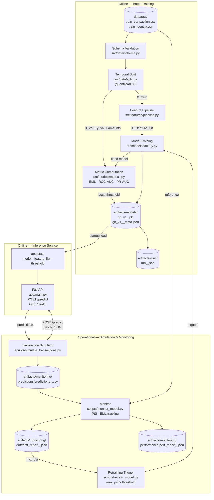
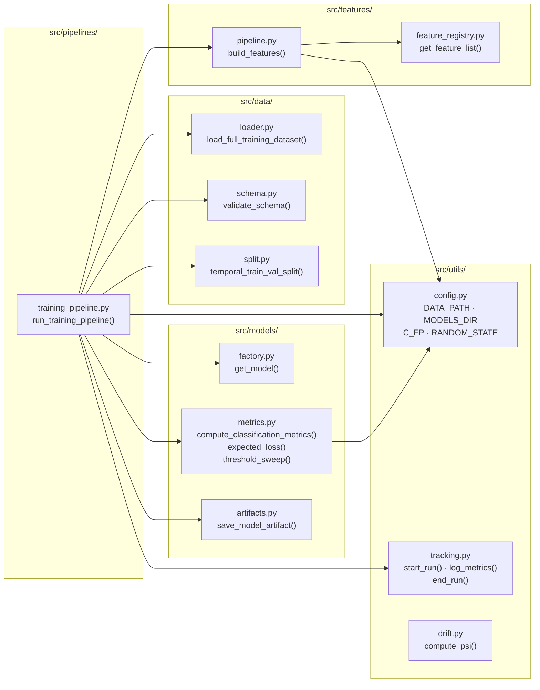
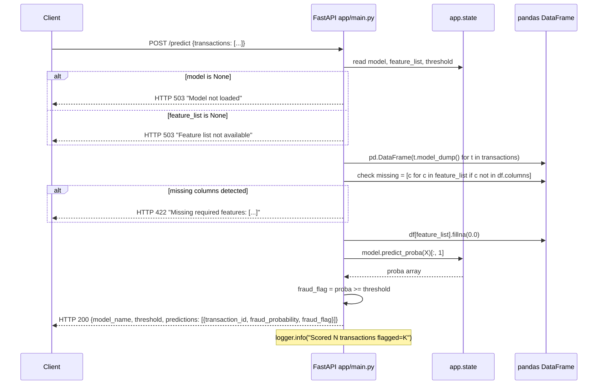
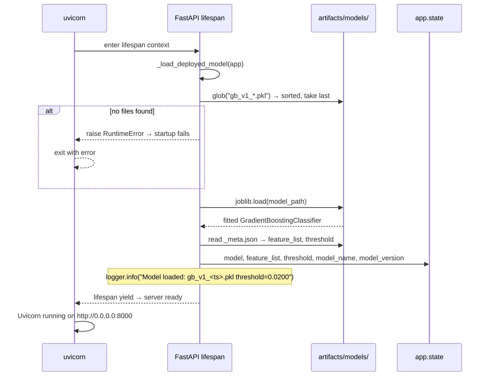
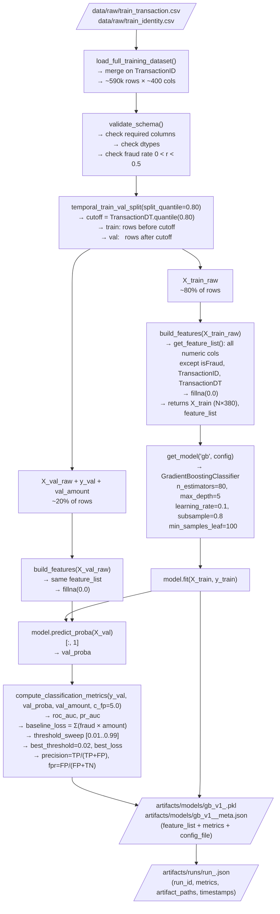

# System Architecture Diagrams

---

## 1. High-Level System Topology

End-to-end view of all components and their relationships. Arrows represent
data flow; labels describe the artifact or protocol at each boundary.

---

## 2. `src/` Module Dependencies

Component-level view of the `src/` package showing which modules depend on
which, and what each module's public interface is.

---

## 3. POST /predict Request Lifecycle

Sequence diagram for a single batch scoring request, including the happy
path and the two error paths (model absent, missing features).

---

## 4. API Startup Sequence

What happens between `uvicorn app.main:app` and the first request being
served successfully.

---

## 5. Training Pipeline Data Flow

Detailed view of how data moves through the training pipeline, from raw
CSV to serialized artifact.

